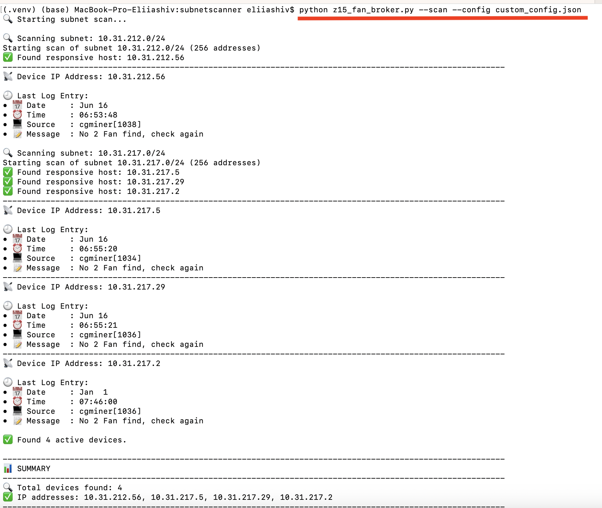
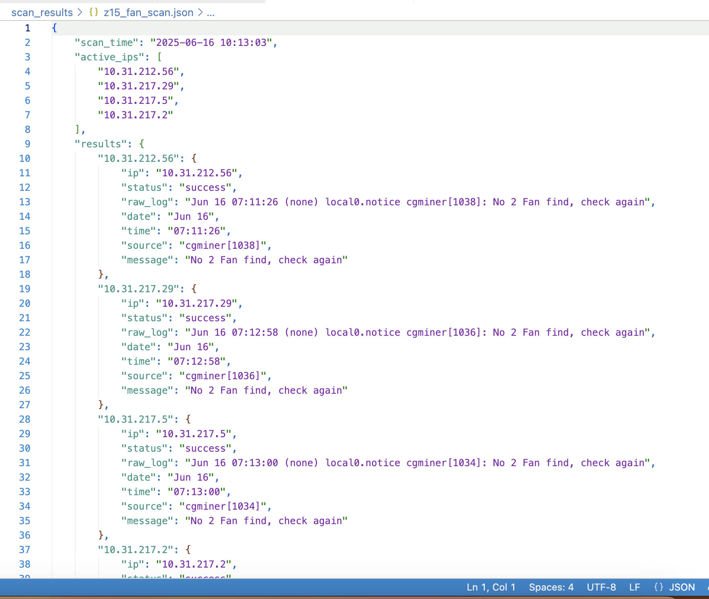
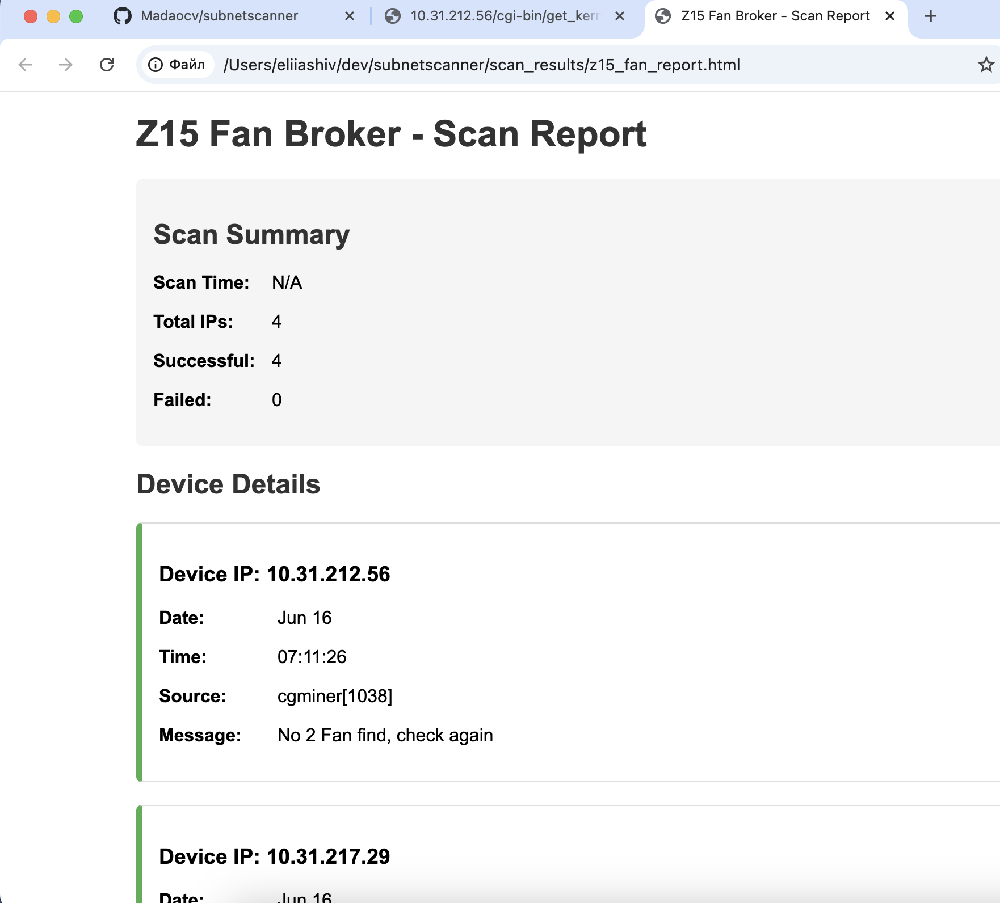

# Subnet Scanner

This project provides tools for scanning subnet IP ranges, detecting responsive devices, and retrieving system logs from them. It includes specialized support for various device types including Z15j, Z15, T21, S21, S21 Pro, S19j Pro, and DG1+.

## Features

- Scan IP subnets to find responsive devices
- Retrieve logs from responsive devices using HTTP requests
- Concurrent scanning for improved performance
- Generate reports in JSON and HTML formats
- Custom configuration options

## Components

1. **subnet_scanner.py** - Core scanning tool that can scan IP ranges and fetch logs
2. **custom_config.json** - Configuration file for subnet settings and credentials
3. **device_registry.py** - Registry for device handlers and detectors with prioritized detection order
4. **device_socket_based_handler.py** - Base handler for devices that communicate via socket API
5. **handlers/** - Directory containing device-specific handlers:
   - **z15j_handler.py** - Handler for Z15j devices with specialized fan status detection
   - **z15_handler.py** - Handler for Z15 devices
   - **t21_handler.py** - Handler for T21 devices
   - **s21_handler.py** - Handler for S21 devices
   - **s21_pro_handler.py** - Handler for S21 Pro devices
   - **s19j_pro_handler.py** - Handler for S19j Pro devices
   - **dg1_handler.py** - Handler for DG1+ devices

## Installation

1. Clone the repository:
   ```
   git clone https://github.com/Madaocv/subnetscanner.git
   cd subnetscanner
   ```

2. Create and activate a virtual environment (recommended):
   ```bash
   # Create a virtual environment with Python 3.9
   python3.9 -m venv .venv
   
   # Activate the virtual environment
   source .venv/bin/activate
   ```

3. Install the required dependencies:
   ```
   pip install -r requirements.txt
   ```

## Usage

### Running Subnet Scanner

To run a subnet scan with the specified configuration file:

```bash
# Scan using specified config file
python subnet_scanner.py --scan --config custom_config.json

# Generate reports based on scan results
python subnet_scanner.py --scan --report --config custom_config.json

# Show only device types summary (without detailed logs)
python subnet_scanner.py --scan --devicetypes --config custom_config.json
```

### Running Site Scanner

The Site Scanner tool uses a hierarchical site configuration file that organizes miners by site locations and subsections:

```bash
# Scan an entire site using a site configuration file
python site_scanner.py site_config_example_1.json

# Scan and save results to a specific output file
python site_scanner.py site_config_example_1.json --output results_site1.json
```

Site Scanner analyzes each subsection of your mining operation, detects devices, identifies issues (missing hashboards, fan problems, low hashrate), and provides a detailed summary comparing expected vs. actual online devices.

### Command Line Arguments

- `--scan`: Run the subnet scanning process
- `--config`: Specify path to configuration file (default: none, uses built-in defaults)
- `--report`: Generate detailed JSON and terminal reports
- `--devicetypes`: Show only device types summary without detailed logs (useful for quick overview)

### Configuration

You can customize the behavior by modifying `custom_config.json`:

```json
{
    "username": "root",
    "password": "root",
    "timeout": 15,
    "subnets": [
        "10.31.212.0/24",
        "10.31.217.0/24"
    ],
    "log_endpoint": "/cgi-bin/get_kernel_log.cgi"
}
```

- **username/password**: Credentials for HTTP Digest Authentication
- **timeout**: HTTP request timeout in seconds
- **subnets**: List of subnets to scan in CIDR notation
- **log_endpoint**: API endpoint for fetching logs from devices

## Output Examples

The tools will generate:

1. Terminal output showing responsive IPs and their log entries
2. JSON file with detailed scan results
3. HTML report for easier visualization (with Z15 Fan Broker)

### Script Execution

The following screenshot shows the script execution and terminal output:



### Report Outputs

#### JSON Report


#### HTML Report


## Docker Deployment

The project includes a full-stack web application with Docker containerization for easy deployment.

### Architecture

The Docker setup consists of 3 containers:

1. **Backend Container** (`subnetscanner_backend`)
   - FastAPI application (Python 3.11)
   - Handles Site/Device/Subsection CRUD operations
   - Executes subnet scanning via `site_scanner.py`
   - Manages execution status and results
   - Port: 8000

2. **Frontend Container** (`subnetscanner_frontend`)
   - Next.js application (Node.js 18)
   - React-based UI for managing sites and devices
   - Port: 3000

3. **Database Container** (`subnetscanner_postgres`)
   - PostgreSQL 15 database
   - Persistent data storage with volumes
   - Stores sites, devices, subsections, and execution results
   - Port: 5432

### Quick Start with Docker

1. Clone the repository:
   ```bash
   git clone https://github.com/Madaocv/subnetscanner.git
   cd subnetscanner
   ```

2. Start all services:
   ```bash
   docker-compose up -d
   ```

3. Access the application:
   - Frontend: http://localhost:3000
   - Backend API: http://localhost:8000
   - API Documentation: http://localhost:8000/docs

4. Stop services:
   ```bash
   docker-compose down
   ```

## Requirements

### Local Development
- Python 3.9+
- Required packages (see requirements.txt):
  - requests
  - ipaddress

### Docker Deployment
- Docker Engine 20.10+
- Docker Compose 2.0+
- 2GB+ available RAM
- 5GB+ available disk space
